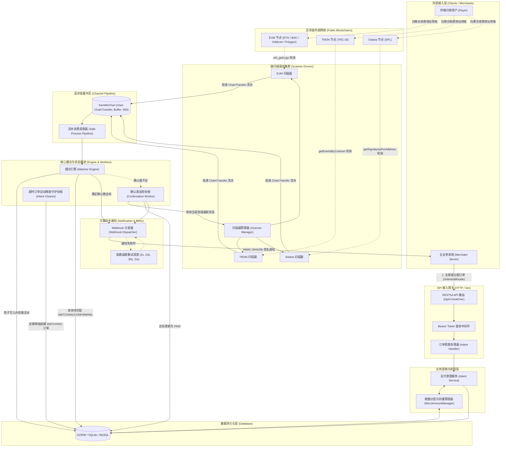
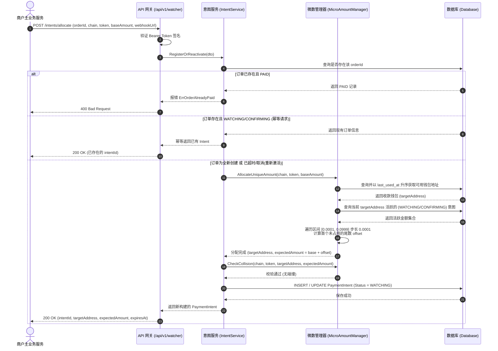
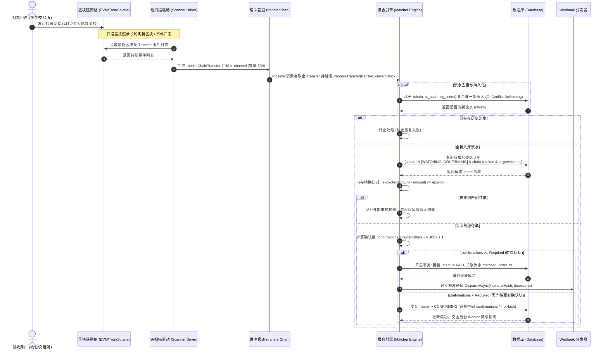
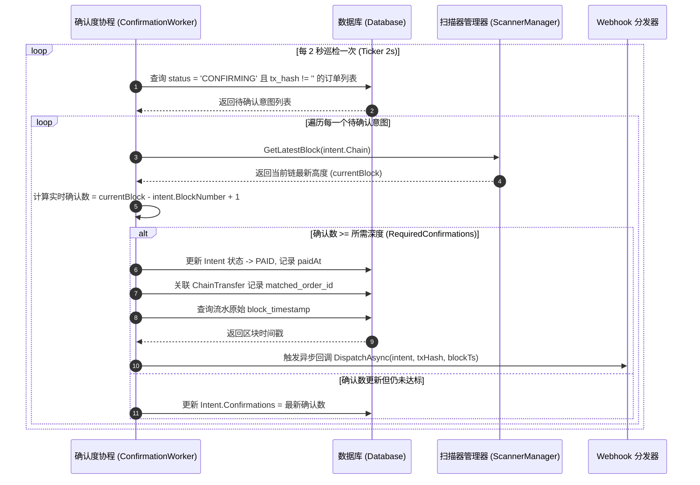
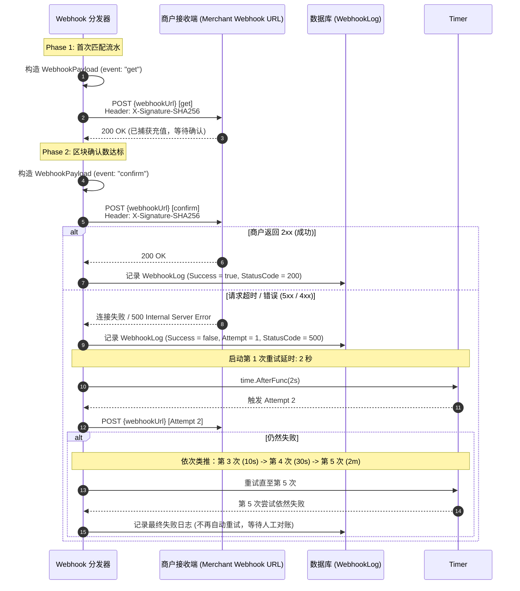
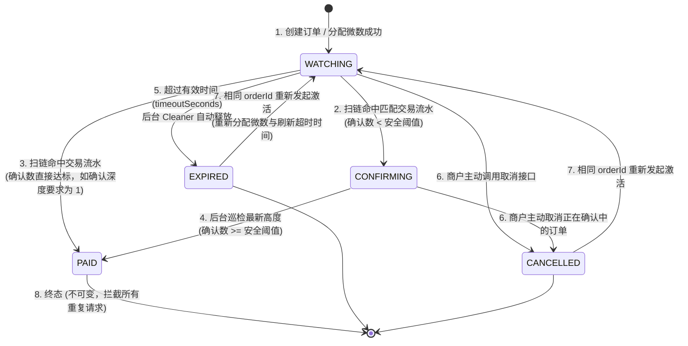
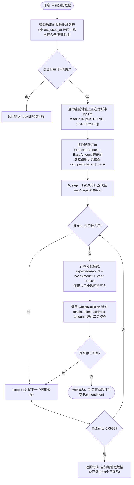
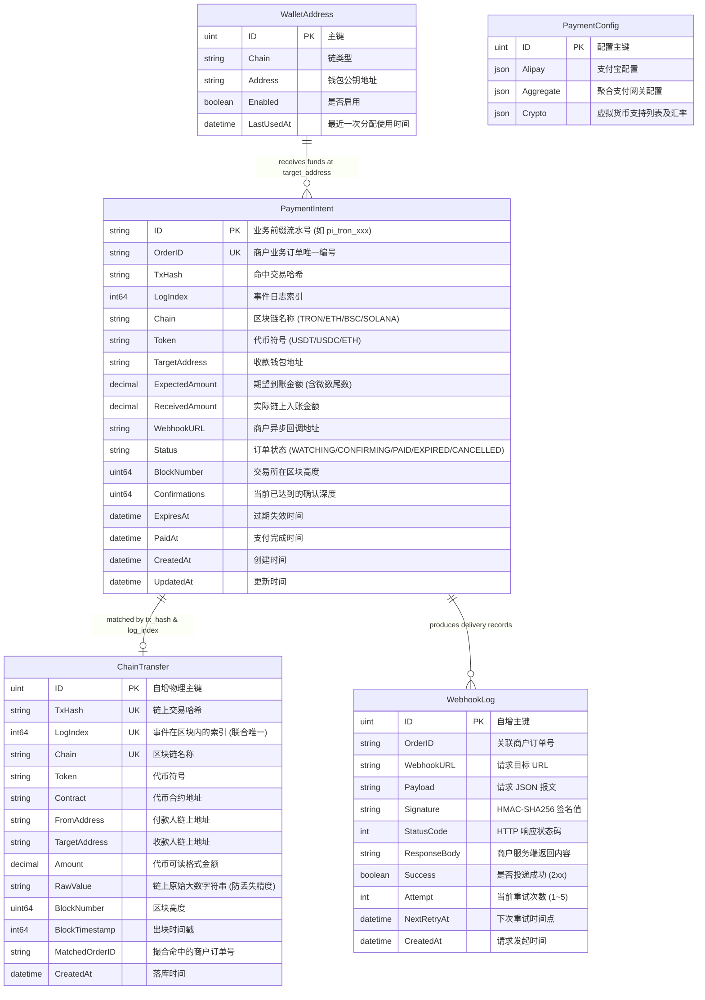
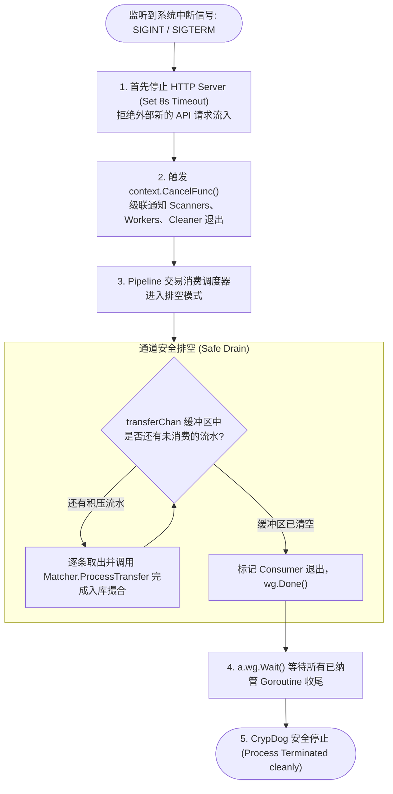

# CrypDog 架构与核心流程设计文档

CrypDog 是一个轻量级、高并发的去中心化虚拟币支付监控网关系统。系统支持多链（EVM 兼容链、TRON、Solana 等）、单地址微数尾数防撞撮合（Micro-Amount Matching）、多阶段区块确认度推进以及带 HMAC-SHA256 防伪签名的异步 Webhook 回调通知。

---

## 1. 整体系统架构与数据流向 (System Architecture)

系统由 **API 网关服务**、**微数资金池管理器**、**多链独立扫描驱动池**、**交易流水通道 Pipeline**、**撮合引擎** 及 **后台异步守护集群** 共同构建。

---

## 2. 核心业务时序图 (Core Sequence Diagrams)

### 2.1 订单注册与微数动态分配流程 (Intent Allocation & Registration)

商户生成订单后，向系统申请收款任务。若未指定精准尾数，系统自动通过地址轮换与动态步长分配独占的微数金额，防止同地址同金额碰撞。

---

### 2.2 扫链、流水入库与实时撮合时序 (Blockchain Scanning & Matching Pipeline)

多链扫描器并发轮询各个公链节点，发现链上代币转账时包装为统一的 `ChainTransfer` 并发往无锁通道，由 Pipeline 消费者安全调度撮合引擎。

---

### 2.3 区块确认度巡检推进时序 (Confirmation Worker Workflow)

针对已命中交易但区块确认数暂未达到安全阈值（如 TRON 需 19 个块防分叉/双花）的订单，后台巡检协程持续追踪并推进最终状态。

---

### 2.4 双段 Webhook 可靠回调与指数退避重试 (Dual-Phase Webhook Delivery & Exponential Backoff)

CrypDog 采用双段 Webhook 架构：
1. **初次捕获 (Phase 1: `get`)**：当链上首次撮合到充值流水时立即发送，携带最新哈希与当前确认数；
2. **确认达成 (Phase 2: `confirm`)**：当区块确认数达成后再次发送，驱动商户完成核销发货。

每段通知均带有独立签名的 `HMAC-SHA256`。若商户响应异常，启动最多 5 次指数退避持久化重试。

---

## 3. 支付意图状态机 (Payment Intent State Machine)

`PaymentIntent` 在其生命周期内严格遵循状态机流转，防止发生状态跳变或脏读并发。

---

## 4. 微数资金池分配与防撞算法 (Micro-Amount Allocation Flow)

当多个订单同时要求支付相同基础金额（如 10.0 USDT）到同一个归集地址时，系统通过微数管理器给每个订单分配独立的尾数偏移（如 10.0001, 10.0002），实现**单地址多笔并发收款的唯一标识性**。

---

## 5. 核心数据库实体关系图 (Entity Relationship - ER)

系统核心包含 5 个数据模型：支付意图任务表、链上流水存证表、出网 Webhook 日志表、钱包地址表与系统支付配置表。

---

## 6. 平滑退出与优雅停机流程 (Graceful Shutdown Flow)

系统采用 Goroutine + Context + WaitGroup + Channel 排空机制，确保在容器重启、发布更新或接收到 `SIGINT / SIGTERM` 信号时不丢任何一笔链上流水。

